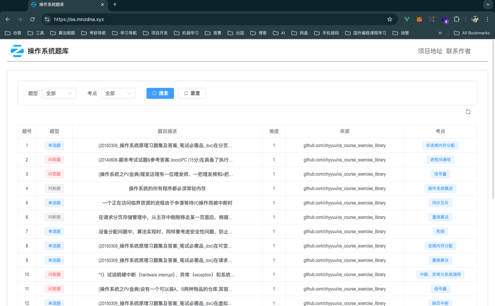
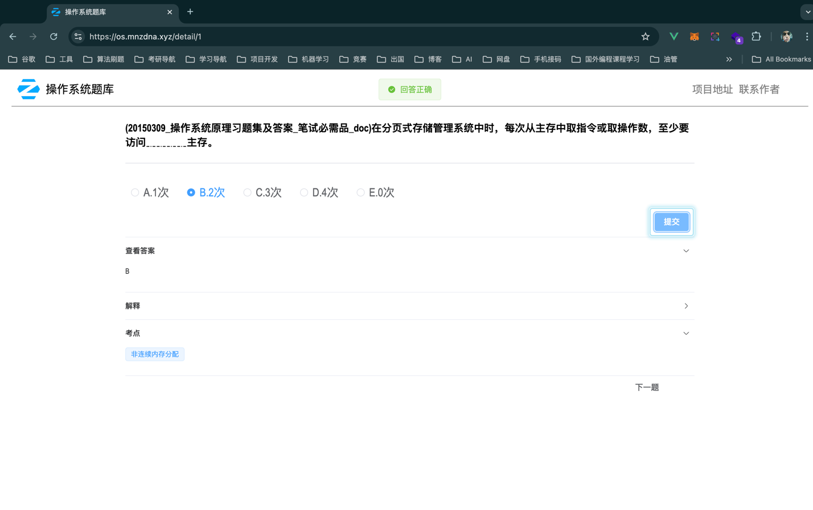
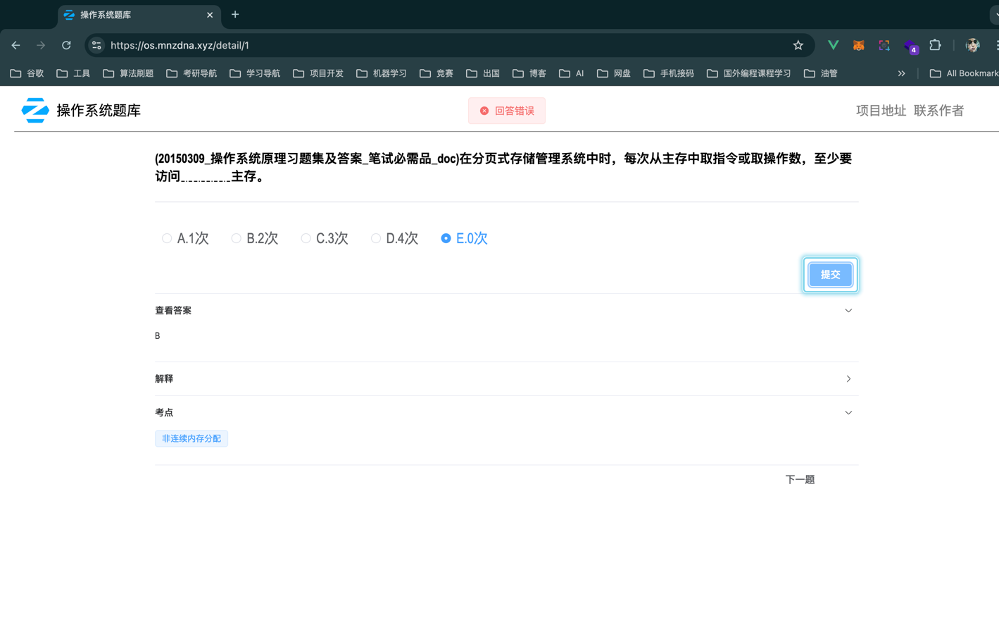

# 操作系统题库

- 在线访问(不保证长期有效): [https://os.mnzdna.xyz/](https://os.mnzdna.xyz/)
- 1500多道，含单选、多选、判断、填空和问答；
- 题库的JSON文件：[data/os_course_exercise.json](data/os_course_exercise.json)
- 支持简单的判题(前端直接对比)

## 效果

## 题库主要来源

- [chyyuu/os_course_exercise_library](https://github.com/chyyuu/os_course_exercise_library)

